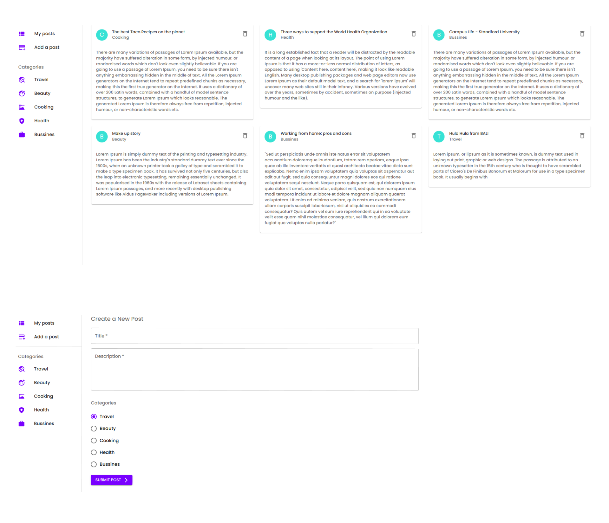

# Posts React App

Posts App build with React Js and Firebase.

## Getting started

1. git clone: $ git clone: https://github.com/BiancaMarin/Posts-app-React.git

2. Add your firebase configuration in src/firebase-config.js

3. npm install (install node modules)

4. npm start (start the server)

## Tech

- React Js
- React Router Dom
- React Hooks
- Firebase and Cloud Firestore
- Styled with Material UI

## Features

- Add a post
- View all the posts
- Filter posts by categories

## Illustration

